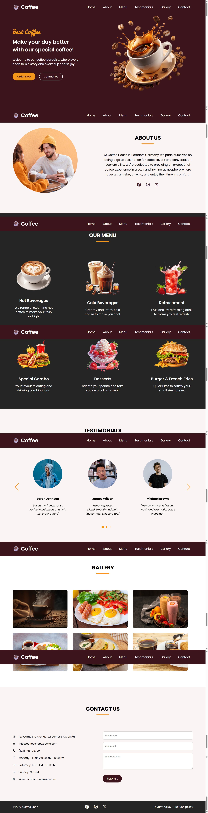

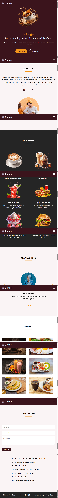

# BanoQabil-CoffeeShop

This repository contains my **final project** for the Web Development course 
at Bano Qabil. It is a fully responsive coffee shop website built using HTML, 
CSS, and JavaScript, bringing together everything learned throughout the course.

## Sections
- **Hero** – Eye-catching intro with call-to-action buttons
- **About** – Brief introduction to the coffee shop with social links
- **Menu** – Showcase of hot beverages, cold beverages, refreshments, combos, desserts, and fast food
- **Testimonials** – Customer reviews in an interactive slider (powered by Swiper.js)
- **Gallery** – Image grid showcasing food and drinks
- **Contact** – Contact details and a working contact form layout

## Features
- Fully responsive design (desktop, tablet, and mobile views)
- Mobile-friendly hamburger navigation menu
- Interactive testimonials carousel using the Swiper.js library
- Smooth scroll navigation between sections
- Clean, modern UI with a warm coffee-themed color palette

## JS Concepts Used
- DOM manipulation and event listeners
- Toggling classes for mobile menu open/close
- Integrating and configuring a third-party library (Swiper.js)
- Responsive breakpoints handled via JS configuration

## Technologies Used
- HTML5
- CSS3 (responsive design with media queries, CSS variables)
- JavaScript
- Swiper.js (slider library)
- Font Awesome (icons)

## Preview

## Author
Sehar Waseem  
Software Engineering Student
